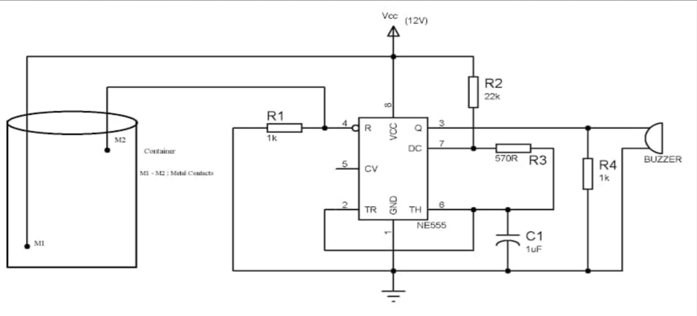
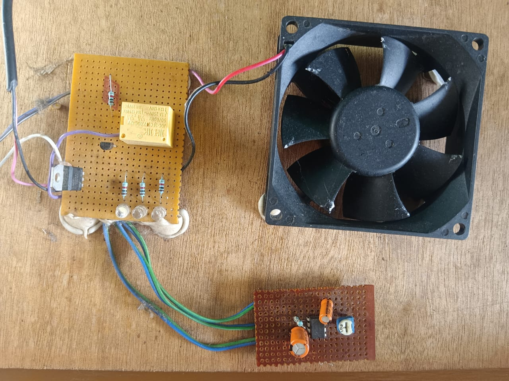
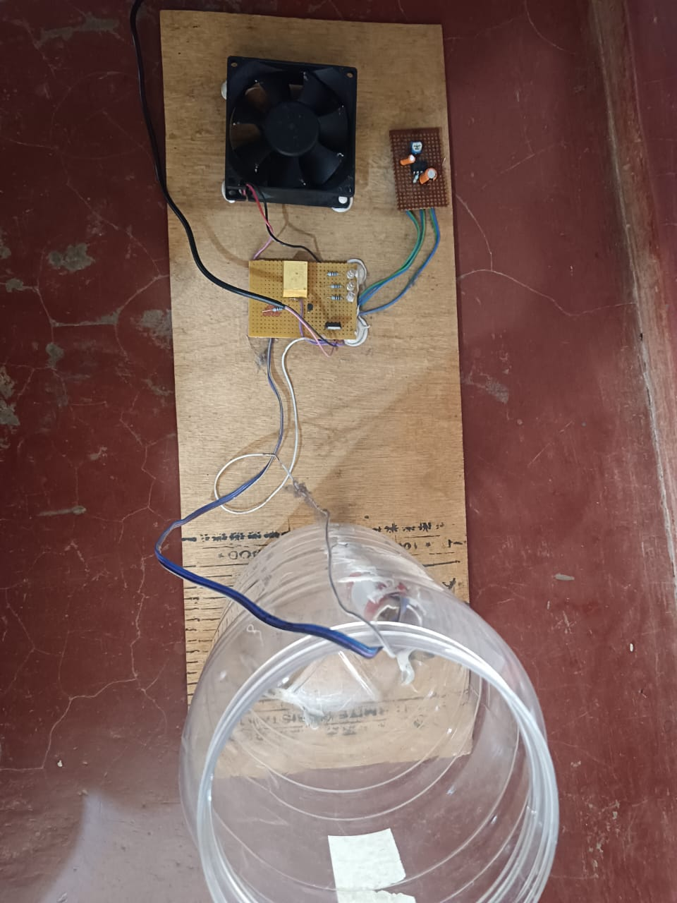

# Automatic Water Level Controller

The Automatic Water Level Controller is a smart electronic system designed to regulate the water level of a storage tank without any manual effort. It continuously monitors the tank’s water level using sensors and automatically switches the pump **ON** when the water is low and **OFF** when the tank is full. This eliminates overflow, prevents pump damage, reduces electricity consumption, and ensures efficient water usage. The system is suitable for homes, buildings, farms, industries, and any place where water storage management is required.

This project uses a simple yet highly reliable electronic control circuit based on the **555 Timer IC**, configured as a **bistable multivibrator**, along with a transistor-driven relay mechanism. The design is low-cost, easy to build, and highly dependable for long-term use.

---

## 🌊 Working Principle

- Water Level Sensing: Probes detect high & low levels.
- 555 Timer: Works as a bistable multivibrator controlling the pump logic.
- Relay Activation: Pump turns ON when water is low and OFF when tank is full.
- Protection: IN4007 diode protects relay driver transistor.

---

## 🧩 Components Used

- **IC 555 Timer** – Acts as a bistable multivibrator to toggle output states  
- **BC547 Transistor** – Amplifies and switches current to drive the relay  
- **12V Relay** – Controls the water pump connection  
- **IN4007 Diode** – Protects the transistor from reverse EMF from the relay coil  
- **Resistors (1MΩ, 1kΩ)** – Used for current limiting and setting thresholds  
- **LED Indicator** – Shows pump ON/OFF status  
- **Water Level Sensors** – Detect high and low water levels inside the tank  

---

## 📊 Circuit Diagram

---

## 🔧 Circuit Operation

1. **Water level falls below LOW sensor →**  
   - The LOW-level trigger activates the 555 timer.  
   - The transistor switches ON.  
   - The relay is energized and the pump **starts**.

2. **Water reaches HIGH sensor →**  
   - The HIGH-level trigger resets the 555 timer.  
   - The transistor switches OFF.  
   - The pump **stops** automatically.

3. **LED indicator** shows the working status of the pump.

This simple control logic ensures the pump only runs when required, resulting in safe, efficient water usage.

---
## 🔧 Hardware Images

### Breadboard Setup

### Final Prototype

## 🎯 Applications

- Domestic overhead water tanks  
- Apartments & residential buildings  
- Agricultural irrigation systems  
- Water sumps and borewell pumps  
- Industrial water storage management  
- Rainwater harvesting tanks  

---

## 🚀 Future Scope

The Automatic Water Level Controller can be enhanced with several advanced features to improve its performance and usability:

- **IoT Integration:**  
  Real-time tank monitoring via mobile apps and cloud dashboards.

- **Dry-Run Protection:**  
  Automatically turns OFF pump if the source water (borewell) is empty.

- **Motor Overload Protection:**  
  Prevents motor overheating and voltage fluctuations damage.

- **SMS/WhatsApp Alerts:**  
  Sends notifications when the tank is full or empty.

- **Automatic Water Quality Monitoring:**  
  Sensors can be added to check turbidity, pH, and contamination.

- **Voice/Smart Home Compatibility:**  
  Integration with Alexa, Google Assistant, or home automation systems.

- **Solar-powered Version:**  
  Use of solar panels to reduce power consumption in rural areas.

- **Multi-Tank Control System:**  
  One controller can manage multiple tanks in buildings or farms.

These enhancements can transform the basic system into a complete **Smart Water Management Solution**.

---
## 📄 Project PPT

Click below to view or download:

👉 [PROJECT (2).pptx](./PROJECT%20(2).pptx)

## ✅ Conclusion

The automatic water level controller offers an efficient and cost-effective solution for managing water levels in tanks.  
By automating pump operation, it conserves water, reduces energy consumption, and eliminates the need for manual intervention.  
The system ensures optimal water usage and pump protection, making it suitable for residential, agricultural, and industrial applications.

With the potential for upgrades like IoT monitoring, dry-run protection, and smart automation features, this design provides a strong foundation for future smart water management technologies.

